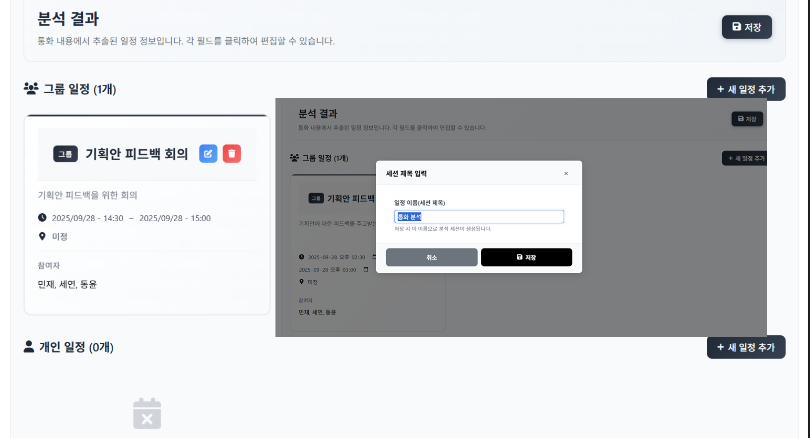

# AI Schedule Web

[](#)
[](#)
[](#)

자연어 입력과 통화 내용을 AI로 분석해 일정 데이터를 구조화하고, Google Calendar, Gmail, ICS 흐름까지 연결하는 일정 관리 웹 서비스입니다.



## 한눈에 보기

- GPT 기반 일정 정보 추출
- JSON 템플릿 기반 출력 구조 고정
- 현재 시간 컨텍스트를 반영한 날짜 보정
- Google OAuth 로그인
- Google Calendar, Gmail, ICS 연동

## 내가 한 것

- 비정형 입력을 일정 데이터로 바꾸는 프롬프트와 출력 구조 설계
- FastAPI 기반 백엔드 구현
- Google Calendar, Gmail, ICS 연동 흐름 구성
- 로그인과 대시보드 중심의 프론트엔드 구현

## 스택

- Backend: Python, FastAPI, Pydantic
- AI: OpenAI API
- Data/Auth: Supabase, JWT, Google OAuth
- Frontend: HTML, CSS, Vanilla JavaScript

## 실행

```powershell
python -m venv .venv
.\.venv\Scripts\activate
pip install -r requirements.txt
python backend/start_server.py
```

## 접속

- `http://localhost:8000/login.html`
- `http://localhost:8000/dashboard.html`
- `http://localhost:8000/docs`
