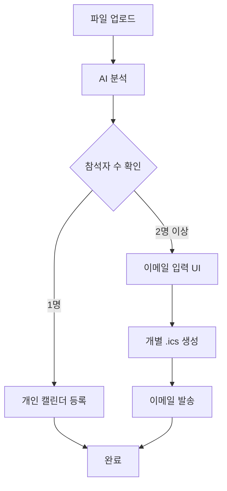

# MUFI - 통화 분석 시스템

## 🎯 프로젝트 개요

MUFI는 통화 내용을 AI로 분석하여 자동으로 일정을 생성하고 관리하는 웹 기반 시스템입니다. 사용자가 업로드한 통화 텍스트 파일을 분석하여 회의 요약, 일정 추출, 참석자 분석을 수행하고, 개별 또는 그룹 일정 관리를 지원합니다.

## 🚀 주요 기능

### 📅 일정 관리
- **캘린더 뷰**: 직관적인 월별 캘린더 인터페이스
- **일정 추가/편집**: 간편한 일정 생성 및 수정
- **오늘의 일정**: 당일 일정 빠른 확인
- **일정 알림**: 중요한 일정 사전 알림

### 🔍 통화 분석
- **AI 기반 분석**: GPT를 활용한 통화 내용 분석
- **자동 요약**: 회의 핵심 내용 자동 요약
- **일정 추출**: 언급된 일정 자동 추출
- **참석자 분석**: 회의 참석자 자동 식별
- **진행률 추적**: 실시간 분석 진행 상황 모니터링

### 📧 메일 보내기
- **일정 공유**: 분석된 일정을 이메일로 자동 발송
- **.ics 파일 첨부**: 캘린더 앱에 바로 추가 가능한 파일 생성
- **개별/그룹 발송**: 참석자 수에 따른 자동 분기 처리
- **발송 이력 관리**: 메일 발송 내역 추적

## 🛠 기술 스택

### Frontend
- **HTML5**: 시맨틱 마크업
- **CSS3**: 모던 스타일링 (밝은 테마)
  - CSS Variables를 활용한 디자인 시스템
  - Flexbox & Grid 레이아웃
  - 반응형 디자인 (Mobile First)
- **JavaScript (ES6+)**: 인터랙티브 기능
  - 모듈화된 클래스 구조
  - 비동기 처리 (async/await)
  - DOM 조작 및 이벤트 처리

### Backend (예정)
- **Python**: 서버 사이드 언어
- **FastAPI**: 고성능 웹 프레임워크
- **OpenAI GPT**: AI 분석 엔진
- **PostgreSQL**: 데이터베이스

## 🎨 디자인 시스템

### 컬러 팔레트 (밝은 테마)
- **Primary Blue**: #2563eb (신뢰감, 전문성)
- **Success Green**: #059669 (성공, 완료)
- **Warning Orange**: #d97706 (주의, 진행중)
- **Danger Red**: #dc2626 (위험, 오류)
- **Info Cyan**: #0891b2 (정보, 알림)
- **배경색**: #ffffff (화이트), #f8fafc (라이트 그레이)

### 타이포그래피
- **Primary Font**: Noto Sans KR
- **Fallback**: -apple-system, BlinkMacSystemFont, Segoe UI, Roboto

### 레이아웃
- **사이드바**: 280px 고정 너비
- **반응형 브레이크포인트**: 
  - Mobile: < 768px
  - Tablet: 768px - 1024px
  - Desktop: > 1024px

## 📁 프로젝트 구조

```
MUFI/
├── frontend/
│   ├── dashboard.html      # 메인 대시보드
│   ├── login.html         # 로그인 페이지
│   ├── css/
│   │   ├── dashboard.css  # 대시보드 스타일
│   │   └── login.css      # 로그인 스타일
│   └── js/
│       ├── dashboard.js   # 대시보드 기능
│       └── login.js       # 로그인 기능
├── backend/               # 백엔드 (개발 예정)
├── docs/                  # 문서
└── README.md             # 프로젝트 설명
```

## 🖥 화면 구성

### 로그인 페이지
- **브랜드 섹션**: 좌측 그라데이션 배경의 브랜드 소개
- **로그인 폼**: 우측 깔끔한 로그인 양식
- **소셜 로그인**: Google, 네이버, 카카오 연동

### 대시보드
- **사이드바**: 3개 주요 메뉴 (일정 관리, 통화 분석, 메일 보내기)
- **헤더**: 사용자 정보 및 프로필
- **메인 콘텐츠**: 섹션별 전용 작업 공간

## 📱 반응형 디자인

### Desktop (> 1024px)
- 사이드바 + 메인 콘텐츠 레이아웃
- 캘린더 + 사이드바 분할 뷰
- 그리드 기반 카드 레이아웃

### Tablet (768px - 1024px)
- 축소된 사이드바 (250px)
- 스택형 캘린더 레이아웃
- 2열 그리드 카드

### Mobile (< 768px)
- 숨겨진 사이드바 (햄버거 메뉴)
- 단일 컬럼 레이아웃
- 터치 친화적 인터페이스

## 🔧 설치 및 실행

### 개발 환경 설정
```bash
# 프로젝트 클론
git clone [repository-url]
cd MUFI

# 개발 서버 실행 (Live Server 등 사용)
# 또는 단순히 dashboard.html 파일을 브라우저에서 열기
```

### 브라우저 지원
- Chrome 90+
- Firefox 88+
- Safari 14+
- Edge 90+

## 🎯 사용 방법

### 1. 로그인
- 데모 계정: demo@mufi.com / password
- 또는 소셜 로그인 사용

### 2. 통화 분석
1. "통화 분석" 메뉴 클릭
2. "새 분석 시작" 버튼 클릭
3. .txt 파일 업로드 (드래그 앤 드롭 지원)
4. AI 분석 완료 대기
5. 결과 확인 및 편집

### 3. 일정 관리
1. "일정 관리" 메뉴 클릭
2. 캘린더에서 날짜 선택
3. 일정 추가/편집
4. 오늘의 일정 확인

### 4. 메일 발송
1. "메일 보내기" 메뉴 클릭
2. 발송할 일정 선택
3. 수신자 입력
4. .ics 파일 첨부하여 발송

## 🔄 워크플로우



## 🎨 UI/UX 특징

### 사용자 경험
- **직관적 네비게이션**: 3개 메뉴로 단순화
- **시각적 피드백**: 호버 효과 및 애니메이션
- **진행 상황 표시**: 실시간 프로그레스 바
- **드래그 앤 드롭**: 파일 업로드 편의성

### 접근성
- **키보드 네비게이션**: 모든 기능 키보드 접근 가능
- **고대비 모드**: 시각 장애인 배려
- **스크린 리더**: 시맨틱 마크업으로 호환성 확보

## 🚀 향후 계획

### Phase 1: 백엔드 개발
- [ ] FastAPI 서버 구축
- [ ] OpenAI API 연동
- [ ] 데이터베이스 설계
- [ ] 사용자 인증 시스템

### Phase 2: 고급 기능
- [ ] 실시간 협업 기능
- [ ] 음성 파일 직접 업로드
- [ ] 다국어 지원
- [ ] 모바일 앱 개발

### Phase 3: 확장 기능
- [ ] 캘린더 앱 연동 (Google, Outlook)
- [ ] 화상회의 플랫폼 연동
- [ ] 팀 워크스페이스 기능
- [ ] 분석 템플릿 커스터마이징

## 📞 문의 및 지원

프로젝트 관련 문의사항이나 버그 리포트는 GitHub Issues를 통해 제출해 주세요.

---

**MUFI** - AI 기반 통화 분석으로 더 스마트한 일정 관리를 경험하세요! 🎯 