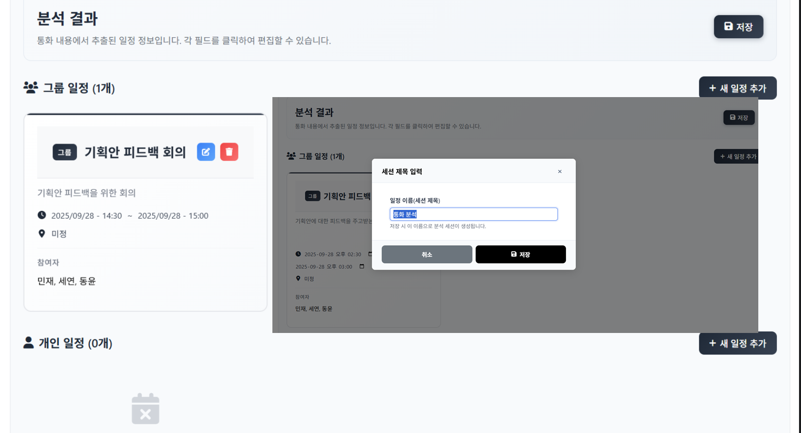

# AI Schedule Web

[](#)
[](#)
[](#)

자연어 입력과 통화 내용을 AI로 분석해 일정 데이터를 구조화하고, Google Calendar, Gmail, ICS 흐름까지 연결하는 일정 관리 웹 서비스입니다.



> **알려진 한계 (학습 프로젝트)**
> 학습 목적으로 만든 초기 프로젝트로, 아래와 같은 보안·구현상 한계가 있습니다. 초기 커밋에 포함됐던 API 키는 모두 폐기 후 재발급했습니다.
>
> - 일부 API가 인증 없이 동작합니다. 일정 조회(`backend/routers/schedules.py`)는 `user_id`를 쿼리 파라미터로 받고, `/members/list`(`backend/routers/members.py`)는 전체 사용자 목록을 반환합니다.
> - Google OAuth 콜백에서 JWT와 Google 자격 증명을 리다이렉트 URL 쿼리에 실어 전달하며(`backend/main.py`), OAuth `state` 검증이 없습니다.
> - LLM 출력은 프롬프트로 JSON 형식을 지시한 뒤 `json.loads`로 파싱하는 방식이며, 스키마 강제(structured output)는 적용하지 않았습니다. 동기 OpenAI 클라이언트를 async 함수 안에서 호출합니다.
> - 자동화된 테스트와 CI가 없습니다.
>
> 개선한다면 모든 라우트에 인증 의존성 적용과 사용자 범위 쿼리, 토큰을 URL 대신 HttpOnly 쿠키로 전달, OAuth `state` 추가, Pydantic 스키마 기반 structured output과 async 클라이언트 전환, 날짜 보정 로직 단위 테스트를 우선하겠습니다.

## What it demonstrates

- GPT 기반 일정 정보 추출
- JSON 템플릿 기반 출력 구조 고정
- 현재 시간 컨텍스트를 반영한 날짜 보정
- Google OAuth 로그인
- Google Calendar, Gmail, ICS 연동

## 내가 한 것

- 비정형 입력을 일정 데이터로 바꾸는 프롬프트와 출력 구조 설계
- FastAPI 기반 백엔드 구현
- Google Calendar, Gmail, ICS 연동 흐름 구성
- 로그인과 대시보드 중심의 프론트엔드 구현

## 스택

- Backend: Python, FastAPI, Pydantic
- AI: OpenAI API
- Data/Auth: Supabase, JWT, Google OAuth
- Frontend: HTML, CSS, Vanilla JavaScript

## 실행

Google OAuth, OpenAI, Supabase 관련 값은 로컬 환경 변수로 설정해야 합니다. 실제 키·토큰은 저장소에 넣지 않습니다.

```powershell
python -m venv .venv
.\.venv\Scripts\activate
pip install -r requirements.txt
python backend/start_server.py
```

## 접속

- `http://localhost:8000/login.html`
- `http://localhost:8000/dashboard.html`
- `http://localhost:8000/docs`

## Scope

이 저장소는 개인 프로젝트의 기능·연동 흐름을 보여주기 위한 공개 코드입니다. 외부 서비스 연동을 재현하려면 각자의 Google, OpenAI, Supabase 설정이 필요합니다.
